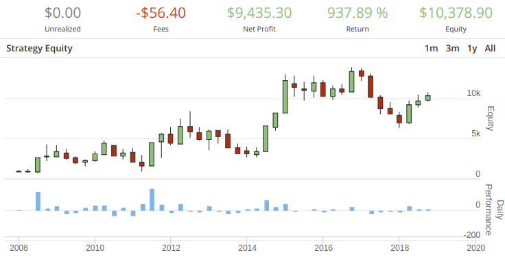
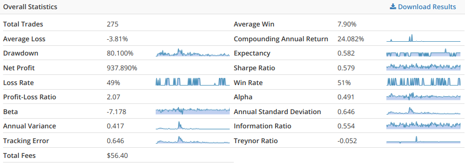

# Eurodollars: Using Failed Trend Reversals in EUR/USD Trend Trading

### Table of Contents
1. [Intro](#intro)
2. [Instructions](#instructions)
3. [Technical Indicators Used](#techind)
4. [SMA](#sma)
5. [Stochastic](#sto)
6. [Strategy](#strat)
7. [Risk Management](#risk)
8. [Possible Improvements](#improve)

### Intro

The foreign exchange (forex) market is the world's largest financial market, and the EUR/USD pair is the most active currency pair in this market. The forex market is also a 24-hour 5.5 day market (unlike stocks or other financial markets that have opening and closing times).

I was naturally drawn to the learning opportunities for exploring an entirely new field (finance), so I decided to devote some time to studying technical analysis, trading strategies, forex-specific topics, and general trading topics.

Over the course of several days (and several trading articles, technical analysis papers, and YouTube strategy videos later), I was able to code up and tweak my algorithmic strategy to turn USD 1,000 to USD 10,000+ in a little over 10 years of backtesting on the EUR/USD pair (from 2008 to 2018).

I used [QuantConnect's LEAN](https://github.com/QuantConnect/Lean/) (an open source trading engine) to backtest and execute trades. It is a full-fledged trading engine with in-built indicators, handlers for live trading/simulating several brokers/markets, and in-built functionality for different kinds of orders such as stop-losses/take-profits. The LEAN trading engine is great for live trading, however, backtesting with historical data is better done on QuantConnect's [website](https://www.quantconnect.com/). This is because of the proprietary origin and nature of the historical data, which is only available on their web platform (and not available for download).

I also used [TradingView](https://www.tradingview.com/) to learn financial technical analysis, charting, and manually verifying several of my approaches before coding them up.

[StockCharts](https://stockcharts.com/school/doku.php?id=chart_school) was also useful in gaining a thorough understanding of several technical indicators. It also presents several scenarios, as well as when it is/isn't best to use each indicator/oscillator.

Special thanks to [makemo8](https://www.youtube.com/user/makemo8) and [UKspreadbetting](https://www.youtube.com/user/ukspreadbetting) (both YouTube channels) for giving me a lot strategies, ideas, and inspiration.

### Instructions

The code is inside the [src](./src) folder. Source code is in Python 3 and is dependent on QuantConnect's LEAN trading engine.

However, as previously mentioned in the intro, the proprietary nature of backtesting data (from multiple brokerages) means that QuantConnect only allows using these data only if the algorithm is backtested using the web interface. The backtesting data is not available for download. For small time traders and other interested hobbyists like me, it is better to just run the algorithm on QuantConnect's web interface (which has access to all backtesting data from multiple brokerages). If you have your own trading data, LEAN's documentation provides information on how to plug them into the trading/backtesting engine.

[Instructions for LEAN Engine (Backtesting on Own Computer with Limited Free Data)](https://github.com/QuantConnect/Lean)
[QuantConnect's Web Interface (Backtesting on QuantConnect with Robust Free Data)](https://www.quantconnect.com/)

### Technical Indicators Used

##### The Simple Moving Average (SMA) Indicator

The SMA indicator takes a simple moving average of the past n periods for each period. Using 2 SMA indicators is a great and simple way to confirm whether a trend is ongoing. When the SMA indicator with the shorter period is above the SMA indicator with the longer period, the market can be said to be trending upwards. A market is trending downwards if the SMA with the shorter period is below the longer SMA. A trend is even stronger if the prices are generally above/below both lines for uptrend/downtrend respectively. Take note that this is a lagging indicator wherein it can only confirm that a trend has recently happened or still be ongoing. It cannot be used to predict whether a trend will happen/continue, because the very nature of the SMA is to look back n periods and take the average.

You can read more about the SMA at [StockCharts](https://stockcharts.com/school/doku.php?id=chart_school:technical_indicators:moving_averages).

##### The Stochastic Oscillator

The stochastic oscillator is used to determine the momentum of a financial instrument. It is also used to identify overbought and oversold signals, which signal trend reversals and are precursors to downtrends/uptrends respectively.

The stochastic oscillator's values ranges between 0 to 100, and it is calculated through the following formula: `(Current Close - Lowest Low)/(Highest High - Lowest Low) * 100`. The highest high and the lowest low are taken from the past n periods. Values above 80 indicate overbought conditions (possibly signalling a downtrend), while values below 20 indicate oversold conditions (possibly signalling an uptrend). Further smoothing of its value are usually done by applying the simple average once or twice to the stochastic (there are several variants such as the Fast %K, Fast %D, Slow %K, and Slow %D, which you can read more about at [StockCharts](https://stockcharts.com/school/doku.php?id=chart_school:technical_indicators:stochastic_oscillator_fast_slow_and_full)).

### Strategy

My strategy is a variant of UKspreadbetting's strategy at https://www.youtube.com/watch?v=pVzimCGxTu8 . Trends can be confirmed using the moving average crossovers as previously discussed. Overbought/oversold conditions can be identified using the stochastic oscillator.

I chose to trade in the hourly markets because there is too much noise in shorter time frames. I also chose the EUR/USD pair because it is the most active pair, and hence, the pair with the smallest spread.

These are 3 steps that must happen before going long (buying):

    1. strong uptrend
    2. subsequently entering a short period of oversold conditions and declining price (indicating a possible trend reversal downwards)
    3. and which then rebounds out of oversold conditions (indicating failure of trend reversal and the continuation of the uptrend)

If all 3 of these are satisfied, a buy market order is entered for 5 micr-lots (5000 units). Using TradingView's charts, I could see patterns wherein strong uptrends would have short periods of declining price (wherein the uptrend seemed to be ending), and which then subsequently rebound upwards and continuing the uptrend even further.

At moments like these, I observed that the subsequent continuation uptrend was just as strong (if not stronger) than the general uptrend. Of course, there were instances wherein the trend reversal ended up being a real trend reversal. These observations subsequently lead me to test and set the take profit and stop loss targets (to be described below).

Conversely, there are 3 steps that must happen before going short (selling):

    1. strong downtrend
    2. subsequently entering a short period of overbought conditions and climbing price (indicating a possible trend reversal upwards)
    3. and which then drops out of overbought conditions again (indicating a failure of trend reversal and the continuation of the downtrend).

The rationale for going short is the converse of the rationale for going long.

### Risk Management

For risk management, I observed there were instances wherein the price would go in the direction of my trade for 5-15 pips before ultimately going on reverse. For example, EUR/USD is on a strong uptrend. It then experiences a trend reversal attempt (temporary downtrend/oversold), before rebounding on and continuing the uptrend. There were instances wherein this continued uptrend would only last on for a further 5-15 pips before dissipating and reversing back into a trend reversal/downtrend. This is my main rationale as to why I placed the take profit orders 7 pips in my direction.

I also observed that there were situations wherein the false trend reversal happened longer than usual, before resuming the trend. For example, EUR/USD is on a strong downtrend. It then experiences a trend reversal attempt (temporary upward price movement). This upward price movement happens longer than expected before the price finally goes back into the downtrend. Sometimes, the trend reversal would go about 20 pips against the trade entered, before the trend resumed. Thus, I placed my stop loss 17 pips against the trade to avoid being stopped out by a longer-than-usual temporary trend reversal.

On TradingView, I observed that trend reversals progressively became stronger and stronger until the last one finally materializes into a real one. Thus I added a new rule: a trade would only be entered if the current trend has not experienced more than 3 trend reversals. On average, the 4th-5th and further trend reversals were very likely to materialize into a real one.

After some more testing, I decided to add one further improvement to make my algorithm much more conservative and increase its win rate. I gained the idea of further improving my algorithm based on the idea of timing from [makemo8](https://www.youtube.com/watch?v=yZcqaEDHwWQ). Timing using multiple timeframes (according to makemo8) is a common method that traders use when choosing a moment to enter a trade. When traders are entering a position based on a downtrend in the hourly chart, a simultaneous downtrend in the minute and daily charts would indicate a strong downtrend. Even though my algorithm trades on the hourly markets, if the hourly and daily trends align, then the trend is a lot stronger. The rationale is that a lot of other traders are also aware that the trends align, hence the buying/selling pressure in the direction of the aligned trend will also be a lot stronger. This means that aligned trends are less likely to have real trend reversals, so the risk of one of my trades getting stopped out (placed during a temporary trend reversal) is lessened.

Even though these improvements made my algorithm a lot more conservative, this made my algorithm have a higher win rate and allowed it to make profits over the long run despite having a profit-loss ratio of 7:17.

### Possible Improvements

For risk management, I could have placed my take profits and stop loss orders based on either the [True Range or the Average True Range](https://www.investopedia.com/terms/a/atr.asp) and then backtesting this strategy.

Another good idea would be to use the [Average Directional Index indicator](https://www.investopedia.com/articles/trading/07/adx-trend-indicator.asp) to indicate the strength of the current trend and take that into account whether to enter a trade or not. A strong trend which experiences a temporary trend reversal is more likely to resume the trend, while a weak trend is more likely to have its trend reversal materialize into a real one.

The current algorithm works well in trend markets, however, its performance degrades when it is in a range-bound market. One reason is that it is difficult to predict whether the market is in a trend or range-bound until after it has started. Thus, an improvement could be to combine this algorithm (which only works on trends) with an algorithm that solely works on range-bound markets. This is because trend strategies only work with trends, and range-bound strategies only work in oscillating markets.

Another possible improvement is to tackle the high negative beta (as seen in the picture above), which means the algorithm has a high inverse correlation with the market and high volatility. Decreasing beta while maintaining profits would decrease volatility and hopefully increase its Sharpe ratio.
